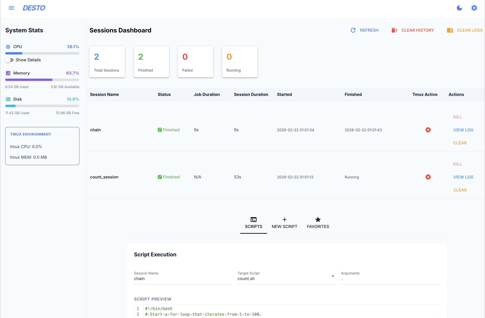
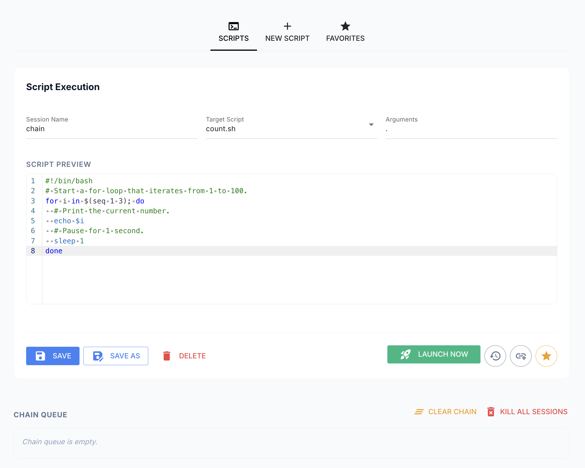
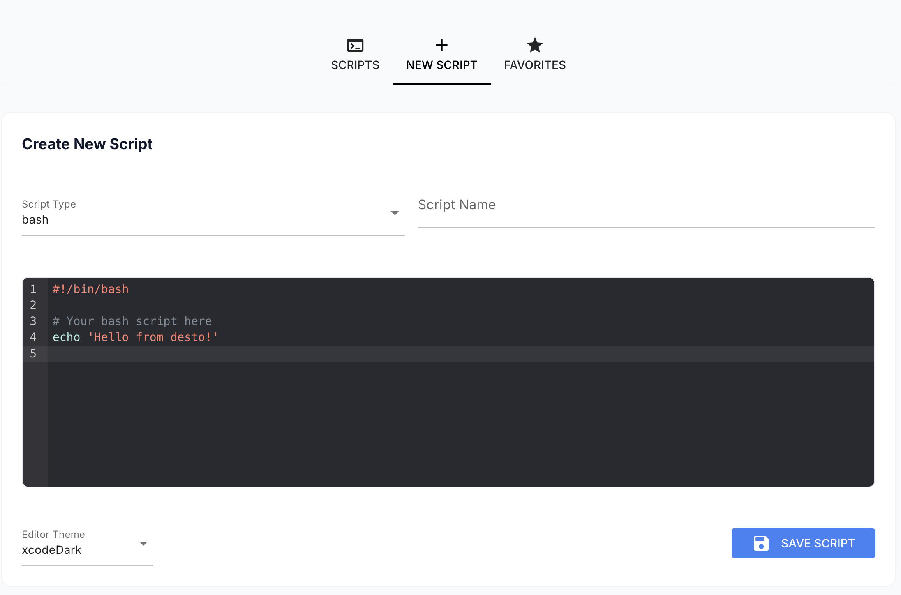
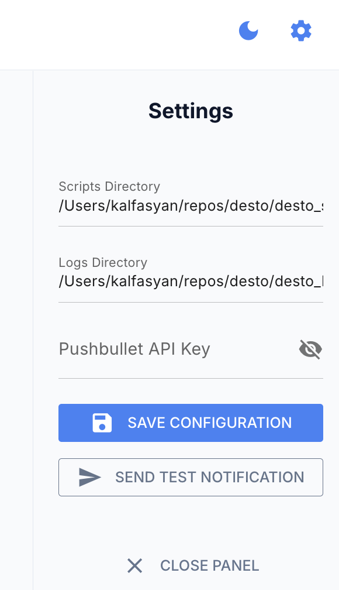
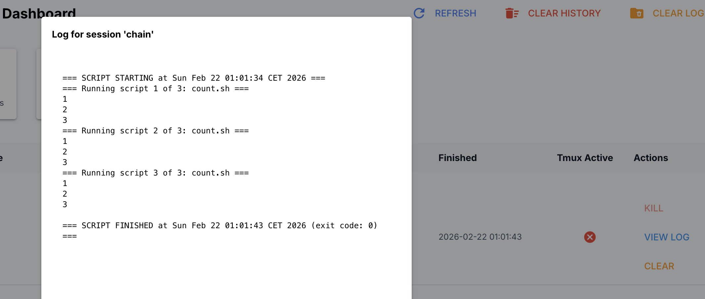

    

  

**desto** lets you run and manage your bash and Python scripts in the background (inside `tmux` sessions) through a simple web dashboard. Launch scripts, monitor their and your system's status, view live logs, and control sessions—all from your browser.  

       

---

The key features are:  

- **One-click session control:** Launch, monitor, and stop `tmux` sessions from your browser.
- **🐚 Bash & 🐍 Python support:** Run both bash (`.sh`) and Python (`.py`) scripts seamlessly.
- **Script management:** Use your existing scripts, write new ones, edit, save, or delete them directly in the dashboard.
- **⭐ Favorite commands:** Save, organize, and quickly run your frequently used commands with usage tracking and search.
- **Live log viewer:** Watch script output in real time and view logs for each session.
- **Live system stats:** See real-time CPU, memory, and disk usage at a glance.
- **Scheduling:** Schedule scripts or script chains to launch at a specific date and time.
- **Script chaining:** Queue multiple scripts to run sequentially in a single session.
- **Session history:** [Redis](https://github.com/redis/redis-py) integration for persistent session tracking and history. [See what is Redis →](https://redis.io/about/)
- **Scheduled job control:** Manage scheduled jobs with a dedicated table—cancel any scheduled job with a click.
- **Session & log cleanup:** Clear session history and delete logs for all or selected sessions.
- **Notifications:** Optional Pushbullet notifications for job/session finishes — set the `DESTO_PUSHBULLET_API_KEY` environment variable or add the key in Settings to receive desktop/mobile pushes when jobs complete.
- **Persistent script & log storage:** Scripts and logs are saved in dedicated folders for easy access.
- **🖥️ Command-line interface:** Manage sessions, view logs, and control scripts from the terminal with our modern CLI. [Learn more →](user-guide/cli.md)
  
  
<strong>🎬 Demo</strong>

## ✨ `desto` Overview

<strong>👀 Dashboard Overview</strong>

  
      

<strong>🚀 Launch your scripts as `tmux` sessions</strong>

When you start `desto`, it creates `desto_scripts/` and `desto_logs/` folders in your current directory. Want to use your own locations? Just change these in the settings, or set the `DESTO_SCRIPTS_DIR` and `DESTO_LOGS_DIR` environment variables.

Your scripts show up automatically—no setup needed. Both `.sh` (bash) and `.py` (Python) scripts are supported with automatic detection and appropriate execution. Ready to launch? Just:

1. Name your `tmux` session
2. Select one of your scripts
3. (OPTIONAL) edit and save your changes
4. Click "Launch"! 🎬

<strong>✍️ Write new scripts and save them</strong>

If you want to compose a new script, you can do it right here, or simply just paste the output of your favorite LLM :) Choose between bash and Python templates with syntax highlighting and smart defaults.

  

<strong>⚙️ Change settings</strong>

More settings to be added! 

  

<strong>📜 View your script's logs</strong>

  

---

## License

Shield: [![CC BY 4.0][cc-by-shield]][cc-by]

This work is licensed under a
[Creative Commons Attribution 4.0 International License][cc-by].

[![CC BY 4.0][cc-by-image]][cc-by]

[cc-by]: http://creativecommons.org/licenses/by/4.0/
[cc-by-image]: https://i.creativecommons.org/l/by/4.0/88x31.png
[cc-by-shield]: https://img.shields.io/badge/License-CC%20BY%204.0-lightgrey.svg

---

## TODO

- [ ] Explore possibility to pause processes running inside a session
- [ ] Add dark mode/theme toggle for the dashboard UI

---

**desto** makes handling tmux sessions and running scripts approachable for everyone—no terminal gymnastics required!
